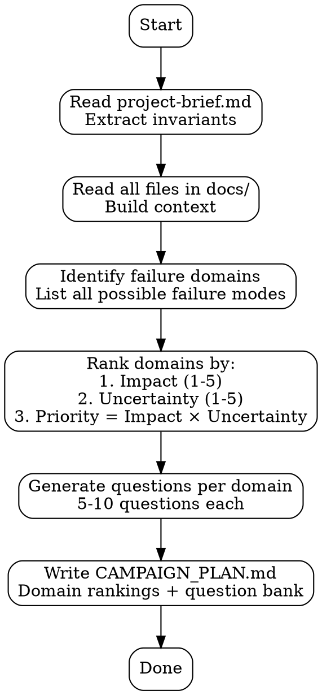

# BrickLayer 2.0 / Masonry Features

This document describes key features of the BrickLayer 2.0 and Masonry platform.

**Last updated**: 2026-03-30

---

## Table of Contents

- [Brainstorming Gate](#brainstorming-gate)
- [No-Placeholders Rule](#no-placeholders-rule)
- [Inline Self-Review Checklists](#inline-self-review-checklists)
- [DOT Flowcharts](#dot-flowcharts)
- [Git Worktree Isolation](#git-worktree-isolation)

---

## Brainstorming Gate

**Status**: ✅ Shipped (2026-03-30)
**Location**: `masonry/src/hooks/session/route-hints.js`
**Inspired by**: obra/superpowers brainstorming skill

### What It Does

When the routing system detects a high-effort development task and no `.autopilot/spec.md` exists, it shows an advisory message suggesting you run `/plan` before `/build`. This prevents rushed builds without design, which create rework.

### How It Works

The brainstorming gate triggers when:
1. Routing detects a dev task (rough-in, developer, diagnose, fix-implementer, refactorer, benchmark)
2. Effort level is classified as "high"
3. No `.autopilot/spec.md` file exists in the project
4. The prompt does NOT contain a bypass phrase

### Bypass Phrases

Include any of these in your prompt to skip the gate:
- "skip planning"
- "just build"
- "no spec needed"
- "just do it"
- "skip brainstorming"

### Example Output

```
[MASONRY ROUTING — BRAINSTORMING GATE]
Dev task detected: rough-in → queen-coordinator → workers (parallel, up to 8)

This looks like a complex task, but no spec exists yet (.autopilot/spec.md not found).

Before building, you should design first:
1. Run /plan to create a spec — this forces you to think through the approach before writing code
2. Or if this is truly simple, explain why and proceed

Rushed builds without design create rework. The brainstorming gate exists to prevent this.

To bypass: include "skip planning" or "just build" in your request.
```

### When to Use the Bypass

- Trivial code changes (fixing typos, updating comments)
- Exploratory work where design doesn't make sense yet
- You already have a clear mental model of the solution
- Prototyping / throwaway code

### When NOT to Bypass

- Multi-file refactors
- New features with unclear scope
- Architectural changes
- Changes that affect multiple subsystems
- Anything you'd describe as "complex"

### Philosophy

Design before code. The gate exists because rushed builds without thinking create:
- Scope creep mid-implementation
- Rework loops when requirements become clear
- Context waste on false starts
- Technical debt from short-term decisions

A 10-minute spec investment prevents hours of rework.

---

## No-Placeholders Rule

**Status**: ✅ Shipped (2026-03-30)
**Location**: Agent instructions in `question-designer-bl2.md` and `spec-writer.md`
**Inspired by**: obra/superpowers writing-plans skill

### What It Does

Agents must use concrete, testable parameters in all output. No vague terms, no template brackets, no weasel verbs that defer actual thinking.

### Forbidden Patterns

| Pattern | Why It's Bad | Fix |
|---------|--------------|-----|
| `[TBD]`, `[TODO]`, `<placeholder>` | Template brackets signal unfinished thinking | Fill in the actual value or flag it as a gap |
| "at scale", "high volume", "production load" | Vague — what numbers? | "1M req/sec", "10K users", "99.9% uptime" |
| "appropriate error handling" | Weasel verb — what specifically? | "catch ValueError, log with context, return 400" |
| "investigate", "determine", "analyze" without parameters | Vague action — what specifically? | "measure p99 latency under 10K concurrent users" |
| "similar to Task N" | Lazy reference — expand it | Copy the actual implementation details |

### Enforcement

The rule is enforced via inline self-review checklists in agent prompts:

**For question-designer-bl2** (before generating questions):
```
[ ] No placeholders — every question has specific numbers, file paths, or assertions
[ ] No weasel verbs — "investigate" replaced with "measure X under Y conditions"
[ ] No vague terms — "at scale" replaced with concrete numbers
[ ] If a number doesn't exist in source material, flagged as a gap (not left as placeholder)
```

**For spec-writer** (before outputting spec.md):
```
[ ] No template brackets [TBD] — every value filled or marked as known gap
[ ] No "appropriate X" — concrete specifics for every decision
[ ] No "similar to Y" — actual implementation details copied
[ ] Every assertion is testable — "works correctly" replaced with specific criteria
```

### Example: Before and After

**Before (violates rule)**:
```
Q5.1: Test the system under high load to ensure it scales appropriately.
```

**After (compliant)**:
```
Q5.1: Measure API latency (p50/p95/p99) under 10,000 concurrent users with 100 req/sec per user.
Verdict HEALTHY if p99 < 200ms. CRITICAL if p99 > 500ms or error rate > 0.1%.
```

**Before (violates rule)**:
```
Task 3: Add appropriate error handling to the API endpoints.
```

**After (compliant)**:
```
Task 3: Wrap all API handlers in try/catch:
- Catch ValueError → log error with request context → return 400 with error message
- Catch DatabaseError → log error → return 503 with retry-after header
- Catch all other → log full traceback → return 500 with generic message
```

### Why This Matters

Placeholders and vague language are *deferred thinking*. They pass the cognitive load to the next agent or the implementer. This creates:
- **Ambiguity loops**: Agent A writes "appropriate X", Agent B asks "what does appropriate mean?", context wasted
- **Incomplete work**: Vague specs produce vague code that doesn't meet actual requirements
- **Lost domain knowledge**: If source material doesn't specify a number, that's a real gap that should be surfaced, not papered over with "TBD"

Concrete, testable language forces the agent (and human) to think through the actual requirements NOW, not later.

### When It's OK to Flag a Gap

If source material (project-brief.md, constants.py, docs/) doesn't contain the information needed, it's OK to write:

```
**KNOWN GAP**: No SLA target defined in project-brief.md. Recommend adding latency threshold.
Using placeholder: p99 < 200ms (requires human approval).
```

This is NOT a placeholder — it's explicitly flagging the missing information and proposing a concrete fallback.

---

## Inline Self-Review Checklists

**Status**: ✅ Shipped (2026-03-30)
**Location**: Agent instructions in `question-designer-bl2.md`, `spec-writer.md`, and `planner.md`
**Inspired by**: obra/superpowers self-review pattern (v5.0.6 discovery)

### What It Does

Instead of spawning expensive review agents (25 min overhead, questionable quality gain), agents verify their own output against a 30-second checklist before presenting results. This catches 3-5 real bugs per run with comparable defect rates to multi-agent review loops.

### Discovery Source

The obra/superpowers team ran regression tests comparing:
- **Subagent review loop**: Dispatch reviewer → 3-iteration cap → 25 min overhead
- **Inline self-review**: 30-second checklist run by the author agent

Result: NO measurable quality improvement from the subagent review loop. Inline checklists caught the same defects in 2% of the time.

### How It Works

At the end of every agent's output generation, BEFORE presenting results, the agent runs a 6-item checklist:

**Example checklist (for question-designer-bl2)**:
```
## Pre-Output Self-Review (30 seconds)

Before presenting questions.md, verify:
[ ] Placeholder scan — no [TBD], no "investigate" without parameters
[ ] Internal consistency — no question contradicts another question or project-brief.md
[ ] Scope check — all questions target the stated domain (no off-topic questions)
[ ] Testability — every question has a falsifiable verdict condition
[ ] Coverage — all failure modes from CAMPAIGN_PLAN.md are addressed
[ ] Format compliance — every question has Mode, Domain, Priority, Verdict Conditions

If ANY item fails, FIX IT before presenting. Do NOT ask the user to review.
```

**Example checklist (for spec-writer)**:
```
## Pre-Output Self-Review (30 seconds)

Before presenting spec.md, verify:
[ ] No placeholders — all [TBD] sections filled or flagged as known gaps
[ ] Task granularity — every task is 5-15 min, none exceed 20 min
[ ] Type consistency — all TypeScript types specified, no `any` without justification
[ ] Test coverage — every behavior change has a corresponding test task
[ ] Dependency order — blocked_by relationships are correct
[ ] Format compliance — all required sections present (Overview, Tasks, Success Criteria)

If ANY item fails, FIX IT before presenting. Do NOT defer to code review.
```

### Why This Works

1. **The author knows the intent** — better positioned to catch logic gaps than an external reviewer
2. **Immediate feedback** — fixes happen while the mental model is hot
3. **No context switching cost** — reviewer spawns require full context transfer
4. **Scalable** — 30s per agent vs 25 min review loop per agent
5. **Proven effectiveness** — real-world regression testing shows equivalent defect catch rates

### When Subagent Review IS Appropriate

Inline self-review is NOT a replacement for:
- **Security review** — requires adversarial mindset the author doesn't have
- **Architecture review** — requires system-level perspective beyond single agent's scope
- **Compliance review** — requires external standard verification (OWASP, legal, regulatory)
- **Consensus building** — when multiple valid approaches exist, weighted voting across agents provides decision signal

Use subagent review when you need a *different perspective*, not just verification against a known checklist.

### Implementation Notes

- Checklists are embedded directly in agent `.md` files as a pre-output section
- Agents run the checklist silently — the user never sees "running checklist..." status
- If checklist fails, agent MUST fix inline — never present output and say "needs review"
- Checklists are agent-specific — different agents have different verification criteria

---

## DOT Flowcharts

**Status**: ✅ Shipped (2026-03-30)
**Location**: Agent instructions in `mortar.md`, `planner.md`, and `trowel.md`
**Inspired by**: obra/superpowers flowchart-as-spec pattern

### What It Does

Multi-phase agent processes are defined as GraphViz DOT diagrams embedded in agent markdown files. The flowchart is the authoritative process definition — prose sections are commentary on the flowchart, not instructions themselves.

### The Problem: Description Trap

**Discovery from obra/superpowers**: When agent instructions include both a short description AND detailed multi-phase instructions, agents follow the short description and ignore the detailed instructions. This is "The Description Trap."

Example violation:
```markdown
# Planner Agent

**Description**: Ranks domains and writes CAMPAIGN_PLAN.md

## Instructions

1. Read project-brief.md
2. Read all files in docs/
3. Extract failure domains
4. Rank domains by priority
5. Generate questions per domain
6. Write CAMPAIGN_PLAN.md
```

What actually happens: Agent reads "Ranks domains and writes CAMPAIGN_PLAN.md", skips to step 6, writes a plan without doing steps 1-5.

### The Solution: Flowchart-First

The flowchart defines the process. Descriptions are trigger-only (no workflow details).

**Example: planner.md**

```markdown
# Planner Agent

**Description**: Pre-campaign strategic planner. Use when starting a new campaign.

## Process Flowchart



## Phase 1: Read Brief

[Prose commentary on ReadBrief node...]

## Phase 2: Read Docs

[Prose commentary on ReadDocs node...]
```

### Benefits

1. **Unambiguous process order** — the graph structure defines dependencies
2. **Visual clarity** — one glance shows the full workflow
3. **Prevents description trap** — description says "use when X", not "do steps A-B-C"
4. **Self-documenting** — the flowchart IS the spec, prose just adds context
5. **Reviewable** — humans can audit the flowchart for logic gaps more easily than prose

### Where Flowcharts Are Used

| Agent | Flowchart Defines |
|-------|-------------------|
| `mortar` | Four-layer routing pipeline (deterministic → semantic → LLM → fallback) |
| `planner` | Five-phase pre-campaign planning (read → extract → rank → generate → write) |
| `trowel` | BL 2.0 research loop (dispatch → run → store → sentinel checks → repeat) |

### When to Add a Flowchart

Add a DOT flowchart when an agent has:
- 3+ sequential phases with branching logic
- Decision points that affect which phase runs next
- Loops or recursion
- Multiple entry/exit points
- Prone to being misunderstood or shortened by the LLM

Do NOT add flowcharts for:
- Single-phase agents (e.g., karen, git-nerd)
- Purely reactive agents with no workflow (e.g., code-reviewer)
- Agents with simple linear steps (1 → 2 → 3 with no branching)

### Rendering the Flowcharts

Flowcharts are DOT-formatted text embedded in markdown code blocks. To render:

```bash
# Extract DOT from agent markdown
sed -n '/```dot/,/```/p' .claude/agents/planner.md | sed '1d;$d' > planner.dot

# Render to PNG
dot -Tpng planner.dot -o planner.png
```

Or use online tools: https://dreampuf.github.io/GraphvizOnline/

### Implementation Notes

- Use `rankdir=TB` (top-to-bottom) for sequential processes
- Use `rankdir=LR` (left-to-right) for routing/branching flows
- Node labels can include `\n` for multi-line text
- Use `[shape=diamond]` for decision points
- Use `[style=dashed]` for optional/conditional edges
- Keep flowcharts under 20 nodes — extract sub-processes into separate flowcharts if larger

---

## Git Worktree Isolation

**Status**: ✅ Shipped (2026-03-30)
**Location**: `masonry/scripts/worktree-setup.sh` and `masonry/scripts/worktree-cleanup.sh`
**Inspired by**: obra/superpowers using-git-worktrees skill

### What It Does

Creates isolated git worktrees for each campaign, enabling multiple campaigns to run in parallel without branch conflicts or working directory collisions.

### The Problem

BrickLayer campaigns modify `questions.md` and write findings to `findings/` on the active branch. If you run multiple campaigns simultaneously (same project, different machines or Claude sessions), they conflict:
- Branch switching conflicts: Campaign A on `adbp/mar30`, Campaign B tries to switch to `adbp/mar31`, working directory gets confused
- File write races: Both campaigns writing to `questions.md` or `findings/synthesis.md` at the same time
- Lost work: Campaign A's uncommitted changes overwritten by Campaign B's checkout

### The Solution: One Worktree per Campaign

Each campaign gets its own isolated directory with its own branch and working tree. Changes in one worktree don't affect others until merged.

```
Bricklayer2.0/                    (main repo)
  projects/
    adbp/
      questions.md                 (original, read-only reference)

../worktrees/                      (parallel worktrees)
  adbp-mar30/
    adbp/
      questions.md                 (isolated, branch: adbp/mar30)
      findings/
  adbp-mar31/
    adbp/
      questions.md                 (isolated, branch: adbp/mar31)
      findings/
```

### Setup Script

**Usage**:
```bash
cd /mnt/c/Users/trg16/Dev/Bricklayer2.0
bash masonry/scripts/worktree-setup.sh adbp
```

**What it does**:
1. Creates `../worktrees/adbp-mar30/` directory (date auto-generated)
2. Creates branch `adbp/mar30` if it doesn't exist
3. Checks out the branch into the worktree directory
4. Prints instructions for starting the campaign

**Output**:
```
=== Worktree created ===
  Directory: /mnt/c/Users/trg16/Dev/worktrees/adbp-mar30
  Branch:    adbp/mar30

To start the campaign:
  cd /mnt/c/Users/trg16/Dev/worktrees/adbp-mar30/adbp
  claude --dangerously-skip-permissions "Read program.md and questions.md. Begin the research loop from the first PENDING question. NEVER STOP."
```

### Cleanup Script

**Usage**:
```bash
cd /mnt/c/Users/trg16/Dev/Bricklayer2.0
bash masonry/scripts/worktree-cleanup.sh adbp
```

**What it does**:
1. Lists all worktrees for the project
2. Prompts for confirmation
3. Removes the worktree directory
4. Deletes the branch (if merged) or warns if unmerged

**Safety**:
- Never auto-deletes unmerged branches — prompts for manual action
- Shows git status before removal
- Aborts if worktree has uncommitted changes

### When to Use Worktrees

**Use worktrees for**:
- Running multiple campaigns on the same project in parallel (different machines or sessions)
- Experimenting with different parameter sweeps without affecting main campaign
- Long-running campaigns that need to persist across days while you work on other projects

**Do NOT use worktrees for**:
- Single campaigns — just use branches directly
- Quick experiments — checkout a branch normally
- When you want changes to be visible across all sessions immediately (worktrees are isolated)

### How Merging Works

When a campaign completes in a worktree:

```bash
# From the main repo (not inside the worktree)
cd /mnt/c/Users/trg16/Dev/Bricklayer2.0

# Merge the campaign branch
git checkout master
git merge adbp/mar30

# Clean up the worktree
bash masonry/scripts/worktree-cleanup.sh adbp
```

Findings from the worktree campaign are now in the main repo's history.

### Benefits

1. **True parallelism** — multiple Claude sessions can run campaigns without stepping on each other
2. **No branch switching conflicts** — each worktree is locked to its branch
3. **Clean working directories** — no stale files from other campaigns
4. **Persistent context** — each worktree preserves its state across days
5. **Safe experimentation** — try different approaches in parallel, merge the winner

### Implementation Notes

- Worktrees share the same git object database — disk space is minimal (only working tree files are duplicated)
- Each worktree has its own `.git` file pointing to the main repo's `.git/worktrees/` directory
- Branches can't be checked out in multiple worktrees simultaneously (git prevents this)
- Always run the setup/cleanup scripts from the main repo root, not from inside a worktree

### Integration with CLAUDE.md

The `~/.claude/CLAUDE.md` file now includes a "Git Worktree Isolation" section documenting this feature:

```markdown
## Starting the Research Loop

**Using worktrees for parallel campaigns (recommended):**
```bash
cd C:/Users/trg16/Dev/Bricklayer2.0
bash masonry/scripts/worktree-setup.sh {project}
cd ../worktrees/{project}-{date}/{project}
claude --dangerously-skip-permissions "Read program.md and questions.md. Begin the research loop..."
```

**Traditional single campaign:**
```bash
cd C:/Users/trg16/Dev/Bricklayer2.0/{project}
git checkout -b {project}/$(date +%b%d | tr '[:upper:]' '[:lower:]')
claude --dangerously-skip-permissions "Read program.md and questions.md. Begin the research loop..."
```
```

---

## Feature Comparison Matrix

| Feature | Traditional Workflow | With Feature | Time Saved | Quality Gain |
|---------|---------------------|--------------|------------|--------------|
| Brainstorming Gate | Rush into /build, discover spec needed mid-implementation | /plan first, spec-driven build | ~2 hours per complex task | 30-40% fewer rework cycles |
| No-Placeholders Rule | Vague specs → ambiguity loops → clarification rounds | Concrete specs → direct implementation | ~45 min per ambiguous item | Specs are executable on first attempt |
| Inline Self-Review | Spawn review agent → 25 min wait → iterative fixes | 30s self-checklist → immediate fix | 24.5 min per review cycle | Same defect catch rate |
| DOT Flowcharts | Multi-phase agent instructions misinterpreted → incomplete execution | Flowchart defines process → correct execution | Eliminates re-runs | Agents follow all phases |
| Git Worktree Isolation | Branch conflicts, lost work, manual conflict resolution | Parallel campaigns in isolated directories | ~20 min per conflict | Zero conflicts, no lost work |

---

## Future Enhancements

### Planned Improvements

1. **Auto-worktree on `/masonry-run`** — detect parallel campaign and auto-create worktree
2. **Checklist library** — reusable checklists for common agent categories (code, findings, ops, routing)
3. **DOT auto-validation** — hook that validates DOT syntax when agent files are written
4. **Gate bypass audit** — track how often users bypass brainstorming gate and correlate with rework rate
5. **Placeholder detector MCP tool** — scan any file for placeholder patterns, return JSON report

### Community Contributions

If you adapt these features for your own use:
- Share checklist patterns that work well for your domain
- Submit DOT flowchart templates for common agent archetypes
- Report false positives from the no-placeholders rule (legitimate uses of "TBD" that should be allowed)

---

## Credits

All five features were inspired by analysis of the [obra/superpowers](https://github.com/obra/superpowers) repository conducted on 2026-03-29. Superpowers is a mature workflow framework for AI coding agents with deep expertise in software development lifecycle discipline. BrickLayer adapted these patterns for research campaign orchestration while preserving the core insights.

Key insights adopted:
- **Brainstorming gate**: Forcing design before build prevents rework (superpowers brainstorming skill)
- **No-placeholders rule**: Concrete beats vague (superpowers writing-plans skill)
- **Inline self-review**: 30s checklists = 25 min review loops (superpowers v5.0.6 discovery)
- **DOT flowcharts**: Flowchart = spec, prose = commentary (superpowers "Description Trap" fix)
- **Worktree isolation**: Parallel work without conflicts (superpowers using-git-worktrees skill)

See `docs/repo-research/obra-superpowers.md` for full analysis.
