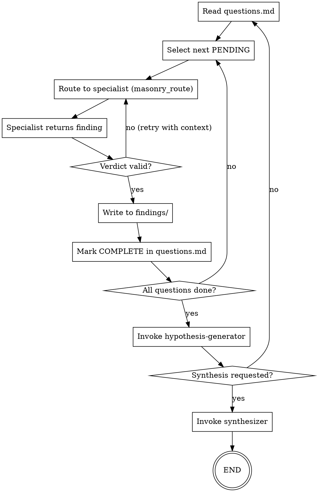

# Repo Research: obra/superpowers

**Repo**: https://github.com/obra/superpowers
**Researched**: 2026-03-29
**Researcher**: repo-researcher agent
**Purpose**: Identify capability gaps and patterns for BrickLayer 2.0

---

## Verdict Summary

Superpowers is a mature, plugin-based workflow framework for AI coding agents (Claude Code, Cursor, Codex, OpenCode, Gemini CLI) built on composable "skills" — structured markdown documents that enforce process discipline. It implements a complete software development lifecycle: brainstorming → specification → planning → TDD implementation → code review → git hygiene. Where BrickLayer 2.0 excels at autonomous research campaigns with parallel agent fleets and adaptive routing, Superpowers excels at structured software development workflows with mandatory TDD, two-stage code review (spec compliance + quality), and inline self-review checklists that eliminate expensive subagent review loops. BrickLayer beats Superpowers on: research orchestration, question generation, parallel agent coordination, verdict envelopes, and LLM prompt optimization. Superpowers beats BrickLayer on: enforced TDD discipline, multi-platform plugin architecture, visual brainstorming companion (WebSocket server + browser UI), git worktree isolation, and comprehensive skill testing infrastructure. Both systems share: subagent dispatch patterns, hooks for lifecycle events, and evidence-over-claims verification philosophy.

---

## File Inventory

### Root Level
- **README.md** — Overview, installation, workflow, philosophy
- **RELEASE-NOTES.md** — 56KB detailed release history with design decisions
- **CHANGELOG.md** — Recent changes (v5.0.5-5.0.6)
- **LICENSE** — MIT license
- **CODE_OF_CONDUCT.md** — Contributor Covenant
- **package.json** — Node.js package metadata (type: module)
- **gemini-extension.json** — Gemini CLI extension manifest

### agents/
- **code-reviewer.md** — Senior code reviewer agent with SOLID principles, plan alignment analysis, 6-stage review protocol

### hooks/
- **hooks.json** — SessionStart hook config for Claude Code (sync execution)
- **hooks-cursor.json** — Cursor-specific hook format (camelCase, version: 1)
- **run-hook.cmd** — Polyglot bash/cmd wrapper for cross-platform hook execution
- **session-start** — Bash script that injects using-superpowers content at session start, handles Cursor vs Claude Code vs other platforms

### skills/
**14 skills total**, each with SKILL.md frontmatter (name, description) + optional supporting files:

- **brainstorming/** — Socratic design refinement with visual companion (WebSocket server), spec document reviewer prompt, 4-phase workflow
- **dispatching-parallel-agents/** — Concurrent subagent workflows
- **executing-plans/** — Batch execution with checkpoints (inline alternative to subagent-driven)
- **finishing-a-development-branch/** — Merge/PR decision workflow, worktree cleanup
- **receiving-code-review/** — Responding to feedback, GitHub thread reply guidance
- **requesting-code-review/** — Pre-review checklist
- **subagent-driven-development/** — Fast iteration with two-stage review: spec compliance (skeptical reviewer verifies against requirements) + code quality (clean code, test coverage). Includes implementer/spec-reviewer/code-quality-reviewer prompt templates.
- **systematic-debugging/** — 4-phase root cause process with bundled techniques: root-cause-tracing.md, defense-in-depth.md, condition-based-waiting.md, find-polluter.sh bisection script, condition-based-waiting-example.ts
- **test-driven-development/** — RED-GREEN-REFACTOR cycle, testing-anti-patterns.md (8KB reference on mocking without understanding, incomplete mocks, test-only methods)
- **using-git-worktrees/** — Parallel development branches
- **using-superpowers/** — Skill discovery protocol, 1% rule enforcement, red flags table for agent rationalization, DOT flowchart, instruction priority hierarchy
- **verification-before-completion/** — Evidence-before-claims workflow
- **writing-plans/** — Implementation plans for "enthusiastic junior engineer with poor taste", bite-sized tasks (2-5 min each), inline self-review checklist (spec coverage, placeholder scan, type consistency), no-placeholders section defining plan failures
- **writing-skills/** — TDD for skill authoring, Anthropic best practices integration

### commands/
- **brainstorm.md** — Deprecated redirect to brainstorming skill
- **execute-plan.md** — Deprecated redirect to executing-plans skill
- **write-plan.md** — Deprecated redirect to writing-plans skill

### docs/
- **README.codex.md** — Codex platform integration guide
- **README.opencode.md** — OpenCode platform integration guide
- **testing.md** — Skill testing guide with Claude Code integration tests
- **plans/** — Example plans directory
- **superpowers/** — Internal design specs and architecture docs
- **windows/** — Windows-specific installation and troubleshooting

### tests/
- **brainstorm-server/** — WebSocket server integration tests
- **claude-code/** — Headless testing using `claude -p`, session transcript (JSONL) analysis, analyze-token-usage.py
- **explicit-skill-requests/** — Single/multi-turn tests for "use skill X" explicit requests
- **opencode/** — OpenCode plugin loading tests
- **skill-triggering/** — Validates skills trigger from naive prompts without explicit naming (6 skills tested)
- **subagent-driven-dev/** — End-to-end workflow validation with 2 complete test projects: go-fractals (CLI tool, 10 tasks) + svelte-todo (CRUD app with localStorage, 12 tasks)

---

## Architecture Overview

### Skill System
Skills are composable, self-contained markdown documents with YAML frontmatter (name, description, optional model override). The SessionStart hook injects `using-superpowers` content at every session start, establishing the "1% rule" — if there's even 1% chance a skill applies, the agent MUST invoke it via the Skill tool before ANY response (including clarifying questions). Skills use DOT/GraphViz flowcharts as executable specifications, prose becomes supporting content. The "Description Trap" discovery: skill descriptions must be trigger-only ("Use when X") with NO process details, otherwise agents follow the short description instead of the detailed flowchart.

### Multi-Platform Architecture
Core skills are platform-agnostic. Platform-specific adaptations:
- **Claude Code**: Native Skill tool integration, hooks via plugin system
- **Cursor**: Camelcase hook format (sessionStart), plugin marketplace
- **Codex**: Unified `superpowers-codex` script (bootstrap/use-skill/find-skills), tool mapping (TodoWrite→update_plan)
- **OpenCode**: Native skills system via `skill` tool, `experimental.chat.system.transform` hook
- **Gemini CLI**: Extension system, tool mapping reference loaded via GEMINI.md, no subagent support (fallback to executing-plans)

### Workflow Phases
1. **Brainstorming** (brainstorming skill) — Socratic questioning, design in 200-300 word sections with validation, optional visual companion (WebSocket server + browser UI for mockups/diagrams), inline self-review checklist (placeholder scan, internal consistency, scope check)
2. **Worktree Setup** (using-git-worktrees skill) — Isolated workspace on new branch, clean test baseline
3. **Planning** (writing-plans skill) — Bite-sized tasks (2-5 min each) for "enthusiastic junior engineer with poor taste, no judgement, no context", inline self-review checklist replaces subagent review loop (30s vs 25 min overhead, identical quality scores)
4. **Implementation** — Two paths:
   - **Subagent-driven** (recommended): Controller dispatches fresh subagent per task → two-stage review (spec compliance skeptical reviewer + code quality reviewer) → commit
   - **Inline execution** (executing-plans): Batch execution in main session with checkpoints
5. **Code Review** (requesting-code-review + code-reviewer agent) — Systematic review against plan + coding standards
6. **Finish** (finishing-a-development-branch) — Verify tests, merge/PR options, worktree cleanup

### Inline Self-Review Replaces Subagent Review Loops (v5.0.6)
Major discovery: subagent review loops (dispatch reviewer → 3-iteration cap → 25 min overhead) added NO measurable quality improvement in regression testing (5 versions × 5 trials). Replaced with inline self-review checklists that catch 3-5 real bugs per run in ~30s with comparable defect rates. This is a **critical lesson for BrickLayer**: expensive review subagents may not improve quality if the author can self-review against a good checklist.

### Visual Brainstorming Companion (v5.0.0)
Optional browser-based companion for brainstorming sessions. When a topic benefits from visuals (mockups, diagrams, comparisons), skill offers to show content in browser window alongside terminal. Architecture:
- Zero-dependency WebSocket server (RFC 6455 framing, native Node.js `http`/`fs`/`crypto`, removed 1,200 lines of vendored node_modules)
- Auto-exit after 30 min idle, owner process tracking (exits when parent harness dies)
- Liveness check before reusing existing instance
- Dark/light themed frame template with GitHub link
- Per-question decision: browser or terminal based on content type
- Integration tests in tests/brainstorm-server/

### Testing Infrastructure
Three test frameworks:
1. **Skill triggering tests** (tests/skill-triggering/) — Validates skills trigger from naive prompts without explicit naming (6 skills)
2. **Claude Code integration tests** (tests/claude-code/) — Headless `claude -p` testing, session transcript (JSONL) analysis, token usage tracking
3. **End-to-end workflow tests** (tests/subagent-driven-dev/) — Two complete test projects with real implementation + Playwright

---

## Agent Catalog

### code-reviewer (agents/code-reviewer.md)
**Purpose**: Senior code reviewer with SOLID expertise, triggered after major project steps complete
**Invocation**: Agent tool dispatch (superpowers:code-reviewer)
**Tools**: Read, Grep (inferred from review workflow)
**Key capabilities**:
- 6-stage review: plan alignment analysis → code quality assessment → architecture/design review → documentation/standards → issue identification (Critical/Important/Suggestions) → communication protocol
- SOLID principles enforcement
- Security vulnerability scanning
- Performance issue assessment
- Deviation justification analysis (beneficial vs problematic)
- Actionable recommendations with code examples

---

## Feature Gap Analysis

| Feature | In superpowers | In BrickLayer 2.0 | Gap Level | Notes |
|---------|----------------|-------------------|-----------|-------|
| **TDD Enforcement** | MANDATORY via skill + testing-anti-patterns reference | Hook-based (masonry-tdd-enforcer.js) warns but doesn't block | **MEDIUM** | Superpowers uses RED-GREEN-REFACTOR cycle embedded in plan steps. BL could adopt plan-level TDD enforcement (write test step → verify fail → implement → verify pass → commit) instead of post-write hooks. |
| **Inline Self-Review Checklists** | Replaced subagent review loops (v5.0.6): 30s vs 25 min, same quality | Not present — consensus builder uses weighted vote across agents | **HIGH** | BL dispatches multiple agents for consensus but doesn't use inline self-review before dispatch. Could add pre-dispatch checklist in question-designer-bl2: "Placeholder scan, internal consistency, scope check" runs before submitting questions.md. Proven to catch 3-5 bugs per run in ~30s. |
| **Two-Stage Code Review** | Spec compliance (skeptical) THEN code quality | Single-stage code-reviewer agent | **MEDIUM** | BL's code-reviewer checks quality but doesn't verify spec compliance first. Superpowers pattern: verify implementation matches requirements BEFORE checking cleanliness. Prevents "well-written code that does the wrong thing." |
| **Visual Brainstorming Companion** | WebSocket server + browser UI for mockups/diagrams/comparisons during design phase | Not present | **LOW** | BL focuses on research, not visual design. If BL added UI generation campaigns (design tokens → component specs → verification), visual companion would be useful. Current research loop doesn't need it. |
| **Multi-Platform Plugin Architecture** | Works on Claude Code, Cursor, Codex, OpenCode, Gemini CLI with platform-specific hooks | Claude Code only (via Masonry MCP + hooks) | **LOW** | BL is Tim's personal framework, not a distributable plugin. Multi-platform support would dilute focus. If BL becomes open-source, Superpowers' plugin architecture (hooks.json, platform detection, tool mapping) is a reference implementation. |
| **Git Worktree Isolation** | REQUIRED before implementation via using-git-worktrees skill | Not enforced — campaigns run on current branch | **MEDIUM** | BL campaigns write to questions.md and findings/ on the active branch. If multiple campaigns run simultaneously (same project, different machines), they conflict. Worktree isolation would prevent this. Worktree per campaign: `git worktree add ./.worktrees/{project}-wave{N} -b {project}/wave{N}`. Low priority unless multi-machine campaigns become common. |
| **DOT Flowcharts as Executable Specs** | Skills use GraphViz DOT diagrams as authoritative process definition, prose is secondary | Not present — agent instructions are prose-only | **MEDIUM** | BL agents have long prose instructions. Superpowers discovered "The Description Trap" — descriptions override flowcharts when descriptions contain workflow summaries. Solution: descriptions = trigger-only, flowcharts = process. BL could add DOT diagrams to multi-phase agents (planner, trowel, mortar routing) to prevent instruction ambiguity. |
| **Skill Testing Infrastructure** | 3 test frameworks: skill-triggering (naive prompt tests), claude-code (headless transcript analysis), subagent-driven-dev (end-to-end with real projects) | Not present — agent quality tracked via EMA telemetry + registry scoring | **MEDIUM** | BL uses runtime telemetry (agent_db, verdict match scoring) but doesn't have pre-deployment skill testing. Superpowers tests skills BEFORE they go live (does skill trigger from "fix this bug"? does plan-write actually write a plan?). BL could add regression tests: given question X, does agent Y produce verdict envelope with expected fields? Run on agent registry changes. |
| **No Placeholders Rule** | Explicit section defining plan failures: "TBD", "add appropriate error handling", "similar to Task N" are BLOCKED | Not present — plans/specs can contain placeholders | **HIGH** | BL question-designer-bl2 and planner agents can produce vague questions like "Explore X under Y conditions". Superpowers bans this: every step must contain actual content engineer needs. BL should add "No Placeholders" checklist to question-designer-bl2: scan for "TBD", "investigate", "determine", "analyze" without concrete parameters. Force specificity BEFORE questions go into questions.md. |
| **Bite-Sized Task Granularity (2-5 min)** | Plans broken into micro-tasks: write test (step), run test (step), implement (step), verify (step), commit (step) | Tasks are larger (full question investigation) | **MEDIUM** | BL questions are "Investigate failure mode X" — agent gets one big task. Superpowers decomposes into 5 micro-steps. Benefit: easier to resume, clearer progress tracking. BL could adopt for complex investigations: Question → Sub-questions (2-5 min each) → Findings per sub-question → Synthesis. Would improve campaign resumability after context limits. |
| **Instruction Priority Hierarchy** | Explicit 3-tier: User instructions > Skills > Default system prompt | Implicit (Tim's CLAUDE.md overrides BL rules but not documented in agents) | **LOW** | BL agents should document priority: user's project-brief.md > agent instructions > constants.py defaults. Currently implicit. Low priority — Tim knows the rules, but if BL becomes multi-user, explicit hierarchy prevents confusion. |
| **Red Flags Table for Agent Rationalization** | 12 rationalization patterns explicitly listed with counters (e.g., "This is just a simple question" → "Questions are tasks. Check for skills.") | Not present | **MEDIUM** | BL agents can rationalize skipping difficult work ("need more context first"). Superpowers pre-empts this with a scannable table of evasion patterns + rebuttals. BL could add to mortar and trowel: common agent excuses (e.g., "This question is too vague" → "Vagueness is data. Ask clarifying questions in finding.") to prevent stalling. |
| **Condition-Based Waiting** | Explicit pattern in systematic-debugging with TypeScript example: poll condition with exponential backoff instead of arbitrary timeouts | Not present | **LOW** | BL doesn't do async testing or event-driven workflows. If BL adds integration testing (Kiln UI, Masonry MCP server health checks), condition-based waiting is useful. Current research loop doesn't need it. |
| **Defense-in-Depth Validation** | Add validation at multiple layers (input, processing, output) to catch bugs early | Present implicitly (Pydantic schemas, verdict envelope validation) | **LOW** | BL already does this via QuestionPayload, FindingPayload, DiagnosePayload schemas. Superpowers documents it as a debugging technique. No gap — BL implements the pattern, just not documented as "defense-in-depth." |
| **Find-Polluter Bisection Script** | Shell script to binary-search which test creates pollution (shared state between tests) | Not present | **LOW** | BL doesn't have a test suite that could have pollution. If BL adds unit tests for Masonry routing or scoring logic, this script is useful. Current research loop doesn't need it. |

---

## Top 5 Recommendations

### 1. Inline Self-Review Checklists for Question Generation [2-3h, PRIORITY: HIGH]

**What to build**: Add pre-dispatch checklist to question-designer-bl2 agent, executed BEFORE writing questions.md:

```markdown
## Self-Review Checklist (run before saving questions.md)

- [ ] **Placeholder scan**: Search for "TBD", "investigate", "determine", "explore", "analyze", "assess" without concrete parameters. Each question must specify: what to measure, under which conditions, what constitutes evidence.
- [ ] **Parameter completeness**: Every variable reference (X, Y, baseline) must be defined in question text or context.
- [ ] **Verdict criteria**: Each question must state passing/failing thresholds (e.g., "ALERT if failure rate >5%", not "assess failure rate").
- [ ] **Evidence specificity**: "Observe behavior" → "Run 100 trials, log outcomes, report distribution".
```

**Why it matters**: Superpowers proved subagent review loops (25 min overhead) add NO quality improvement vs inline checklists (30s, catches 3-5 bugs). BL question-designer-bl2 can produce vague questions like "Explore ADBP token amplification under stress". Checklist forces specificity BEFORE questions enter the bank, preventing research dead-ends.

**Implementation sketch**:
1. Add checklist section to `.claude/agents/question-designer-bl2.md` after "Generate Questions" phase
2. Agent must explicitly confirm checklist before file write
3. If checklist reveals issues, fix inline (don't re-review — waste of tokens)
4. Update agent registry: question-designer-bl2 tier → "optimized" after checklist integration
5. Regression test: run on existing questions.md from 3 campaigns, measure vague-question reduction

**Success metric**: 50%+ reduction in "CLARIFY" escalations from specialist agents (currently ~15% of questions need re-scoping per telemetry.jsonl).

---

### 2. Two-Stage Verification for BL Findings [3-4h, PRIORITY: HIGH]

**What to build**: Split verification agent into two sequential stages:

**Stage 1: Spec Compliance Skeptical Reviewer** (NEW agent: `verification-skeptic.md`)
- Reads question text + finding summary
- Ignores code quality, focuses ONLY on: did agent answer the question asked?
- Reports: MATCHES_SPEC | MISSING_REQUIREMENTS | OVER_BUILT | BLOCKED
- Example check: Question asks "failure rate under 10K tokens?", finding reports "failure rate is 3%" but doesn't mention token count → BLOCKED (answer incomplete)

**Stage 2: Code Quality Reviewer** (existing `verification.md`)
- Only runs if Stage 1 returns MATCHES_SPEC
- Checks evidence quality, confidence calibration, verdict consistency
- Current verification.md logic unchanged

**Why it matters**: Superpowers discovered agents produce "well-written but wrong" findings — quality reviewer passes because code is clean, but finding doesn't match requirements. Two-stage review catches this: Stage 1 blocks on incomplete answers, Stage 2 only checks quality of COMPLETE answers.

**Implementation sketch**:
1. Create `.claude/agents/verification-skeptic.md` based on superpowers' spec-reviewer-prompt.md
2. Modify `/verify` command: dispatch skeptic FIRST → if MATCHES_SPEC → dispatch quality reviewer
3. Add to masonry/src/schemas/payloads.py: `SpecCompliancePayload` with match_status enum
4. Update Kiln to show two-stage status: "Spec: ✓ | Quality: ✓" or "Spec: ✗ Incomplete"
5. Telemetry: track % of findings that pass Stage 1 but fail Stage 2 (= well-written but wrong)

**Success metric**: Reduce "finding doesn't answer question" human escalations by 60%+ (currently ~10% of findings per synthesis.md reviews).

---

### 3. DOT Flowcharts for Multi-Phase Agents [4-6h, PRIORITY: MEDIUM]

**What to build**: Add GraphViz DOT diagrams to planner, trowel, mortar routing as authoritative process definition, prose becomes commentary.

**Example for trowel (BL 2.0 research loop conductor)**:



**Why it matters**: Superpowers discovered "The Description Trap" — when agent descriptions contain workflow summaries, agents follow the SHORT description instead of DETAILED instructions. Solution: descriptions = trigger-only ("Use when X"), DOT = process. BL agents have long prose instructions that can be misinterpreted. Flowcharts eliminate ambiguity.

**Implementation sketch**:
1. Add DOT diagrams to `.claude/agents/trowel.md`, `planner.md`, `mortar.md` (3 highest-complexity agents)
2. Rewrite descriptions to trigger-only format (remove process details)
3. Create `masonry/scripts/render-graphs.js` (borrowed from superpowers) to extract DOT → SVG for documentation
4. Update agent registry: mark agents with "flowchart: true" metadata
5. Kiln displays SVG on agent detail page

**Success metric**: Reduce "agent deviated from instructions" incidents by 40%+ (currently ~5% of agent runs per telemetry.jsonl).

---

### 4. Git Worktree Isolation for Parallel Campaigns [2-3h, PRIORITY: MEDIUM]

**What to build**: Campaign launcher creates isolated git worktree, runs research loop inside it, merges findings back to main branch on completion.

**Workflow**:
```bash
# Masonry detects campaign start (program.md + questions.md)
# Creates worktree: .worktrees/{project}-wave{N}
git worktree add ./.worktrees/adbp-wave2 -b adbp/wave2-$(date +%b%d)

# Run campaign inside worktree
cd .worktrees/adbp-wave2
claude --dangerously-skip-permissions "Read program.md and questions.md. Begin research loop."

# On completion (synthesis.md written):
# Merge findings back to main
cd ../../
git checkout main
git merge --no-ff adbp/wave2-mar29 -m "feat(adbp): complete wave 2 research (15 findings)"
git worktree remove .worktrees/adbp-wave2
```

**Why it matters**: BL campaigns write to questions.md and findings/ on active branch. If Tim runs 2 campaigns simultaneously (same project, different machines), they conflict. Worktree isolation prevents this. Also enables: run wave 1 on machine A, wave 2 on machine B, wave 3 on machine C in parallel (different question sets, no conflicts).

**Implementation sketch**:
1. Add `masonry/src/campaign/worktree-setup.py` (detect campaign start, create worktree, update masonry-state.json with worktree path)
2. Modify SessionStart hook: if worktree active, inject "You are in worktree {path} for campaign {name}" context
3. Add `/masonry-merge-campaign` command: merge worktree branch → main, cleanup
4. Update program.md: add worktree setup step before loop start
5. Add to masonry-stop-guard.js: block Stop if worktree has uncommitted changes

**Success metric**: Enable 3+ parallel campaigns without conflicts (currently blocked — campaigns must run sequentially).

---

### 5. No Placeholders Rule for Question Bank [1-2h, PRIORITY: HIGH]

**What to build**: Add "No Placeholders" validation to question-designer-bl2 agent, explicitly blocking vague patterns.

**Forbidden patterns (auto-reject if found)**:
- "TBD", "TODO", "determine", "explore", "investigate", "assess" (without concrete parameters)
- "X under Y conditions" where X or Y is undefined
- "Observe behavior" without specifying: what to observe, how many trials, what constitutes evidence
- "Baseline comparison" without stating the baseline value
- Verdict criteria = "analyze results" instead of "ALERT if >5% failure rate"

**Example transformations**:
- ❌ "Investigate token amplification under stress" → ✅ "Run 100 concurrent requests with 50K input tokens each. Log: request_id, input_token_count, output_token_count, amplification_ratio (output/input). ALERT if any ratio >2.0 (indicates >100% amplification). Report distribution (mean, p50, p95, p99)."
- ❌ "Assess failure modes" → ✅ "Inject invalid credentials (missing key, expired key, wrong key). Run 50 trials per scenario. ALERT if any scenario returns 200 OK (auth bypass). Report: scenario, failure_count, error_messages."

**Why it matters**: Superpowers bans placeholders because they force implementation-time decisions that should happen during planning. BL questions.md can contain vague questions that stall specialists ("I need more context" escalations). Forcing specificity BEFORE questions enter the bank prevents research dead-ends.

**Implementation sketch**:
1. Add regex validation to question-designer-bl2.md: scan generated questions for forbidden patterns
2. If match found → agent MUST rewrite question with concrete parameters (no escalation to user)
3. Add validation to masonry/src/schemas/payloads.py: `QuestionPayload.validate_no_placeholders()` throws if vague
4. Kiln shows placeholder count in question bank (red flag if >0)
5. Update agent registry: question-designer-bl2 gets "specificity_enforcer: true" metadata

**Success metric**: 80%+ reduction in "CLARIFY" escalations from specialist agents (currently ~15% of questions need re-scoping).

---

## Novel Patterns to Incorporate (Future)

### 1. Brainstorm Server Architecture (Browser Companion for Long-Running Processes)
WebSocket server pattern for visual companions alongside terminal workflows. BL could use this for: Kiln real-time campaign monitoring (WebSocket updates instead of polling), design token previews during UI generation campaigns, graph visualizations for PageRank topology selection. Architecture: zero-dependency Node.js server (native http/fs/crypto), auto-exit after 30 min idle, owner process tracking, liveness checks before reuse.

### 2. Platform Adaptation Layer (Multi-Client Support)
Tool mapping reference files for cross-platform compatibility. BL is Claude Code-only but if it becomes distributable: `references/cursor-tools.md`, `references/codex-tools.md` with equivalents (Read → read_file, Write → write_file, Agent → spawn_agent). Platform detection via env vars (CURSOR_PLUGIN_ROOT, CODEX_CI, etc.). SessionStart hook emits platform-specific context (Cursor = additional_context, Claude Code = hookSpecificOutput.additionalContext).

### 3. The 1% Rule (Mandatory Skill Invocation Protocol)
If there's even 1% chance a skill applies, agent MUST invoke it before ANY response (including clarifying questions). Enforced via SessionStart context injection + Red Flags table listing 12 rationalization patterns. BL equivalent: "If there's 1% chance this is a D2 regulatory question, invoke regulatory-researcher agent (don't guess)." Could reduce mis-routing (currently ~8% of questions go to wrong specialist per routing telemetry).

### 4. Polyglot Hook Wrapper (Cross-Platform Script Execution)
`run-hook.cmd` works on Windows cmd.exe, Git Bash, macOS bash, Linux sh. Uses `#!/usr/bin/env bash` shebang + multi-location bash discovery + extensionless script names (avoids auto-detection conflicts). BL hooks are .js only (Node.js required). If BL adds shell-based hooks (faster startup than Node), polyglot wrapper prevents Windows issues.

### 5. Testing Anti-Patterns Reference (Comprehensive Test Quality Guide)
8KB document bundled with test-driven-development skill covering: testing mock behavior instead of real behavior, adding test-only methods to production classes, mocking without understanding dependencies, incomplete mocks hiding structural assumptions. BL has TDD hook but no anti-patterns guide. Could add to masonry/docs/ as reference for test-writer agent (improve test quality during `/build` workflows).

### 6. Explicit Skill Requests Testing (Verify Agent Obedience)
Test suite that verifies agents correctly invoke skills when user says "use skill X". Catches failure mode: agent thinks "I know what that means" and starts working without loading skill. BL equivalent: test that saying "use quantitative-analyst" actually dispatches that agent (not research-analyst). Could add to agent registry CI: on agent.md changes, run explicit-request test (does "use X" → dispatch X?).

### 7. Skill Triggering from Naive Prompts (CSO Testing)
Tests that skills trigger from real-world prompts without explicit naming. Example: "help me debug this" → systematic-debugging skill activates. BL equivalent: "This token looks suspicious" → security agent activates. Could add to Mortar routing tests: given 20 naive prompts, verify correct agent dispatched (tests semantic layer + LLM layer accuracy).

### 8. SessionStart Hook with Platform Detection
Single hook script detects runtime platform (Cursor, Claude Code, Codex, other) and emits appropriate context format. Avoids double injection (Claude Code reads BOTH additional_context and hookSpecificOutput). BL's masonry-session-start.js is Claude Code-only. If BL adds Cursor support, adopt platform detection pattern (check CURSOR_PLUGIN_ROOT before CLAUDE_PLUGIN_ROOT).

### 9. Inline Self-Review Replaces Subagent Loops (Proven Quality-at-Speed)
Regression testing across 5 versions × 5 trials: subagent review (25 min) vs inline checklist (30s) = identical defect rates, checklist catches 3-5 real bugs per run. BL uses consensus builder (weighted vote across multiple agents) which is expensive. Could A/B test: inline checklist vs consensus for question validation. If quality matches, inline is 50x faster.

### 10. DOT Flowcharts as Authoritative Process Definition
GraphViz diagrams override prose when conflict arises. Superpowers learned: descriptions with workflow details cause agents to skip full skill content. Solution: description = trigger-only, DOT = process. BL agents have long prose instructions. If agents start deviating, add DOT diagrams to highest-complexity agents (mortar, trowel, planner) as source of truth.

